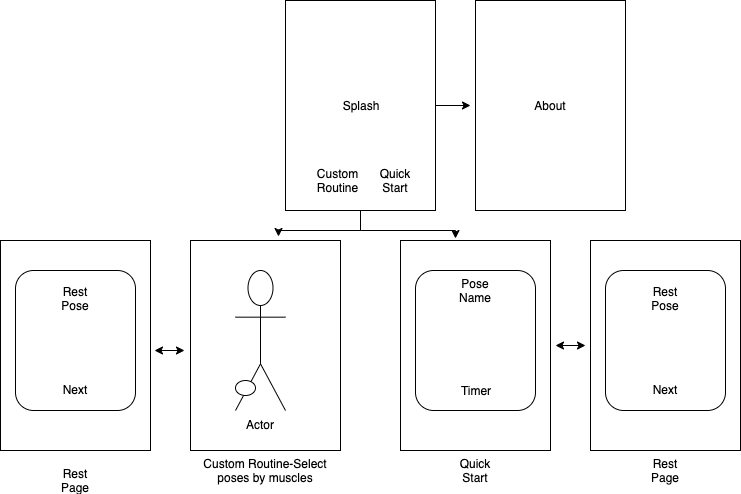
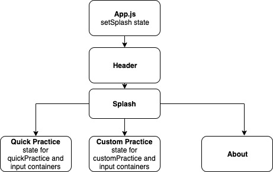

# _Shaolin Yin Yoga_

#### _Custom and Random Yin Yoga Practices, 2019_

#### By _**Micah Zaayer**_

## Description

_This mobile app compiles a set of random Yin Yoga poses for users based on how long they would like to practice for and how long they would like to hold each pose for. There is no other app out there for Yin Yoga practitioners._

  

  

## Setup/Installation Requirements
* _Requires Expo on mobile device_
* _Clone Repo_
* _$ npm i_
* _$ npm start_
* _Open camera on mobile device, scan QR code in Expo window or terminal_

## Known Bugs

_The 'Custom Practice' feature does not work at the moment._

## Support and contact details

_Please contact Micah Zaayer at Zaayer@protonmail.com if you find any bugs._

## Technologies Used

_React Native, JavaScript, Expo, Webpack_

### License

*MIT License*

Copyright (c) 2019 **_Micah Zaayer_**
